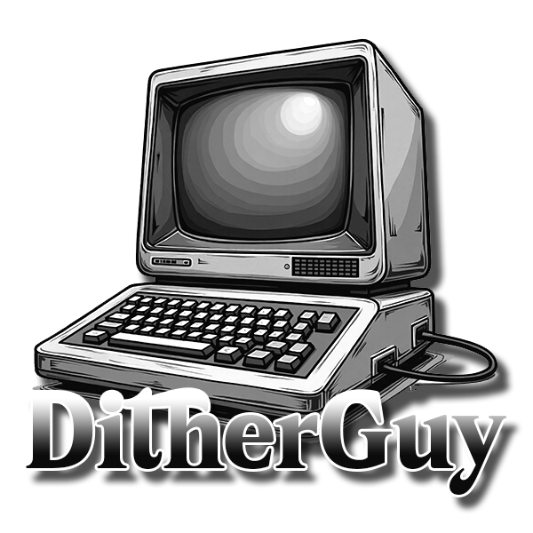
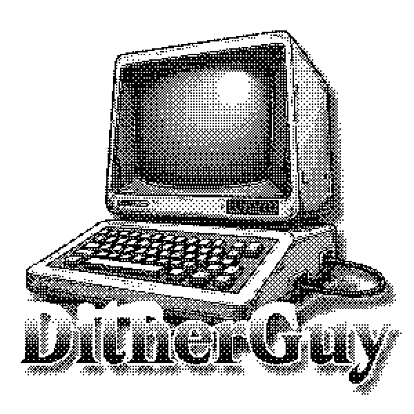
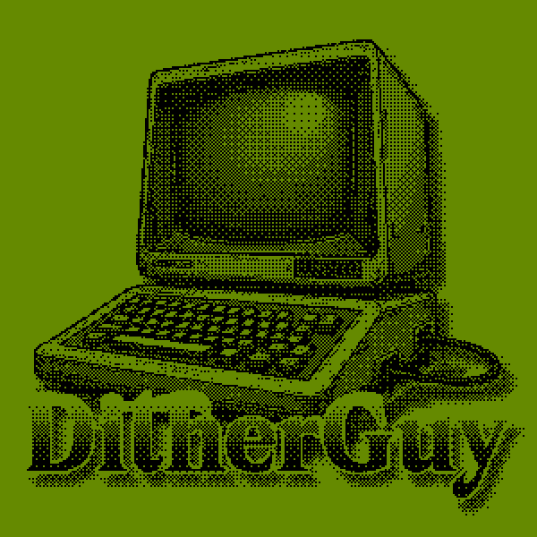
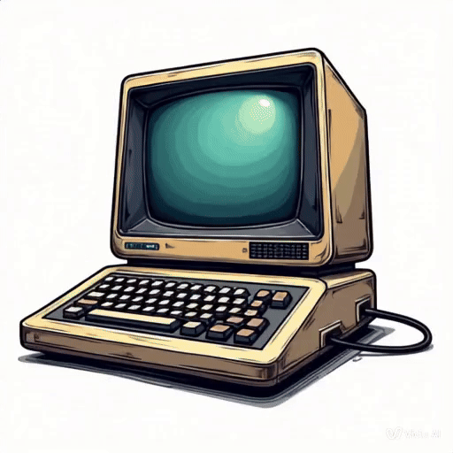
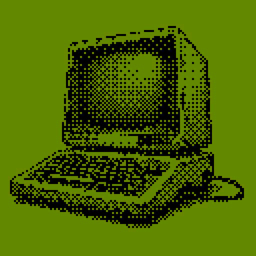

# Dither Guy (Updated)

Dither Guy is inspired by the [Dither Boy](https://studioaaa.com/product/dither-boy/) software, used to create graphic dithering effects, similar to old screens.

Is a simple Python script that converts images to dithered images. It supports multiple dithering algorithms to achieve the effect. The script is written in Python and uses the Pillow library to process images.


**Changelogs**
- added more filters
- fixed image preview window
- moved to Qtpyside6 for ui
- added brightness, contrast etc options.

## Input x Output

<div style="display: inline-block; margin-right: 10px;">
  
</div>
<div style="display: inline-block;">
  
</div>
<div style="display: inline-block;">
  
</div>

## How to use

To use the script, you need to have Python installed on your computer. You also need to install the dependencies using the following command: 

```bash
pip install -r requirements.txt
```

After installing the dependencies, you can run the script using the following command:

```bash
python dither_guy.py
```

To generate an executable file, you can use the following command:

```bash
pyinstaller --onefile dither_guy.py
```

Note: You need to have the PyInstaller library installed on your computer to generate the executable file. You can install
the PyInstaller library using the following command:

```bash
pip install pyinstaller
```

## BETA Video Dithering




