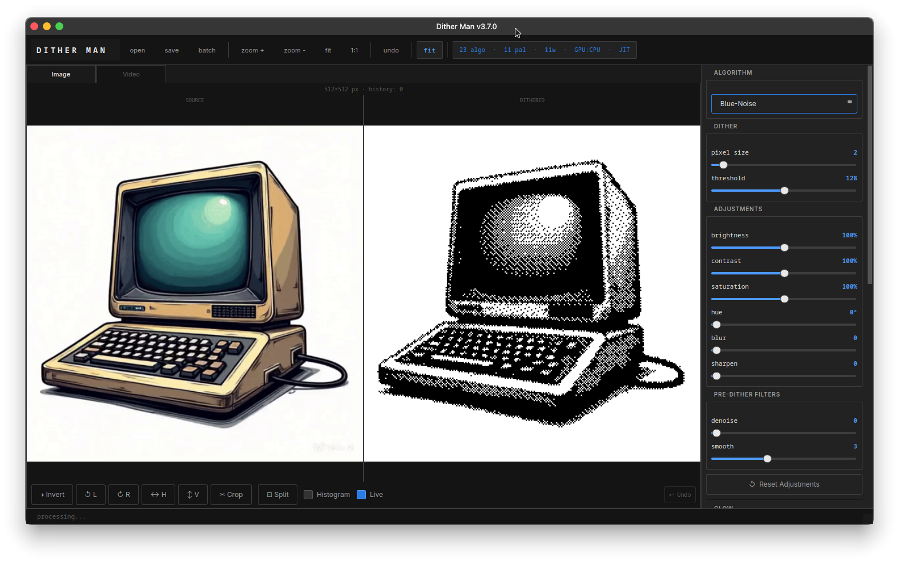
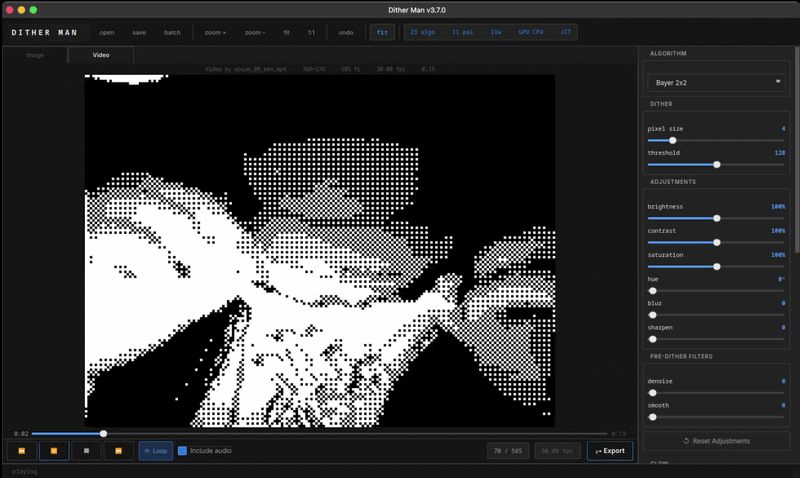

<div align="center">

# Dither Guy


**Dither Guy** is a software inspired by [Dither Boy](https://studioaaa.com/product/dither-boy/)

[](https://github.com/manoelpiovesan/dither-guy/actions)
[](https://github.com/manoelpiovesan/dither-guy/releases/latest)
[](https://github.com/manoelpiovesan/dither-guy/releases)
[](LICENSE)
[](https://python.org)
[](https://github.com/manoelpiovesan/dither-guy/releases)
[](https://ko-fi.com/L3L61SRB88)

<br>

[Download](https://github.com/manoelpiovesan/dither-guy/releases/latest) •
[Development](#development) •
[Contributors](#contributors)

</div>

## About

**Dither Guy** is a software inspired by [Dither Boy](https://studioaaa.com/product/dither-boy/), designed to create graphic dithering effects similar to those found on old displays and low color-depth systems.

The project focuses on providing a simple and straightforward tool for applying dithering to images and videos, preserving a controlled and retro visual aesthetic.

# Preview


<p align="center">
  
</p>


<p align="center">
  
</p>


# Installation

Download the latest release for your platform:

###  [Windows](https://github.com/manoelpiovesan/dither-guy/releases/latest) | [Linux](https://github.com/manoelpiovesan/dither-guy/releases/latest) | [macOS](https://github.com/manoelpiovesan/dither-guy/releases/latest)

# Development

```bash
python3 -m venv venv

source venv/bin/activate

pip install -r requirements.txt

python3 dither_guy.py
````

# Contributors

Special thanks to everyone contributing and supporting the project.

* [@shahil-sk](https://github.com/shahil-sk)
* [@momed081](https://github.com/momed081)
* Timo Frank (supporter)


# Support the Project

If you enjoy the project and want to support future development:

<p align="left">
  <a href="https://ko-fi.com/L3L61SRB88">
    
  </a>
</p>


# Star History

<p align="center">
  <a href="https://www.star-history.com/?repos=manoelpiovesan/dither-guy&type=date">
    <picture>
      <source 
        media="(prefers-color-scheme: dark)" 
        srcset="https://api.star-history.com/chart?repos=manoelpiovesan/dither-guy&type=date&theme=dark"
      />
      <source 
        media="(prefers-color-scheme: light)" 
        srcset="https://api.star-history.com/chart?repos=manoelpiovesan/dither-guy&type=date"
      />
      
    </picture>
  </a>
</p>

<div align="center">
